# Bounded Draft Pick Value Charts: A Bayesian Monotone Approach for the NFL Draft

**Navya Teja Pathuri**

UNC Charlotte 
Mentor: Dr. Michael Schuckers
"Bounded Draft Pick Value Charts"

---

## Abstract

NFL teams trade draft picks using value charts that assign one number to each
pick, with no statement of how certain that number is. I build a draft pick
value chart from on-field performance that has two properties: value never
increases with pick number, and every pick's value comes with credible bounds.
Performance is measured by a player's cumulative Approximate Value over his
first five seasons (CUMYr5), for all 3,584 players drafted from 2012 to 2025.
For the 2022-2025 classes, whose five seasons are not complete, CUMYr5 is
multiply imputed (100 imputations) from the seasons observed so far, using a
model chosen by leave-one-draft-class-out validation. The value curve is fit
with a Bayesian nonparametric monotone regression built on Bernstein
polynomials (Wilson et al., 2020), adapted to decreasing curves and implemented
in Python; its prior settings were chosen by a simulation study in which the
95% bands contained the true curve 94-95% of the time. The first pick is worth
39.7 AV (95% bounds 36.7-42.5) on the smooth chart, the last pick of round one
23.9 (22.7-25.0), or 60% of the first pick, compared with about 20% on the
traditional Jimmy Johnson chart. Isotonic regression, monotone XGBoost and
splines predict individual players about as well, but none of them provide
bounds. The data also show the first overall pick to be a special case (54 AV
on average) that any smooth chart understates.

---

## 1. Introduction

In the NFL draft each team takes turns choosing newly eligible players, and the
right to choose (a pick) can be traded. Teams therefore need an exchange rate
between picks: what is the 10th pick worth in terms of the 20th and 45th?

The best-known answer is the "Jimmy Johnson chart" from the 1990s, which gives
pick 1 3,000 points, pick 32 590 points and pick 100 100 points. It was built
from trades teams had made, not from what drafted players went on to do.
Performance-based charts (for example Schuckers, 2011) instead value each pick
by the average on-field value of players taken there, and they found the
traditional chart greatly overvalues the top picks. Salary-based approaches
(Massey and Thaler, 2013) reach a similar conclusion.

Existing charts share two gaps:

1. **Monotonicity.** A fitted curve, or a table of averages, can say a later
   pick is worth more than an earlier one, which makes no sense for a pick
   that can always choose the same player as the later one.
2. **Uncertainty.** A chart gives one number per pick. Those numbers are
   estimates from a few hundred players per round, but no published chart
   reports how uncertain they are.

This project addresses both. I estimate a value curve that is **monotone
non-increasing** by construction and report **credible bounds** for every pick,
using the Bayesian nonparametric monotone regression of Wilson et al. (2020).
I also handle the most recent draft classes, whose players have not finished
five seasons, by multiple imputation, so their uncertainty carries into the
bounds.

## 2. Data

### 2.1 Sources

- **Draft list:** the draft tables on Pro-Football-Reference (PFR) for
  2012-2025: 3,584 players (253-262 per year) with round, overall pick, team,
  position, college and PFR player ID. Supplemental-draft picks are not
  included.
- **Season performance:** regular-season games (G) and Approximate Value (AV)
  for every player's first five seasons, from Stathead Football (Sports
  Reference's query tool), exported by draft class.
- **Jimmy Johnson chart:** points for picks 1-224, for comparison only.

The season data were taken from Stathead exports rather than scraped.

**Approximate Value** (Drinen, Sports-Reference) is PFR's single-number rating
of a player-season at any position; it is the performance measure used in this project.

### 2.2 Variables

For a player drafted in year Y, season k (k = 1, ..., 5) is season Y + k - 1.

- AVk and Gk: AV and games in season k.
- **CUMYrk** = AV1 + ... + AVk, and CUMGk likewise for games.
- **CUMYr5**, value over the first five seasons (roughly a rookie contract),
  is the outcome for the chart.

Rules applied:

1. A season that has been played but in which the player has no record counts
   as AV = 0 and G = 0.
2. A season that has not happened yet (after 2025) is left blank.
3. A player who played for two teams in a season gets his season total, not an
   average of his team rows.
4. Players who never played have AV = 0 and G = 0; games played distinguishes
   them from players who played with 0 AV.
5. The five negative AV values PFR assigns (for example Jared Goff 2016, -2)
   are kept as reported.
6. Values are regular season only.

### 2.3 Checks

Automated checks confirm that every year's picks run 1..max with no gaps or
repeats; that every Stathead row matches the draft list on draft year and pick
through the player ID; that no player-season appears twice; that cumulative
values are complete up to the seasons played and blank after; and that for
every player whose career ended within his five-season window, total games
match the career games on the draft page. One data-collection pitfall was
found and fixed: paged query results can repeat a row and skip another when
rows are tied, so from 2018 on each draft round was exported as its own
single-page query. Eleven players were also checked season by season against
their PFR pages, covering traded seasons, players who never played, missed
seasons and a 2025 rookie; all eleven match.

### 2.4 Summary

Among the complete classes 2012-2021 (2,549 players), CUMYr5 has median 8,
mean 12.8 and maximum 85; 17.8% of players have 0. Mean CUMYr5 by round is
30.0, 20.8, 15.2, 10.4, 8.6, 5.3 and 3.6 for rounds 1-7.

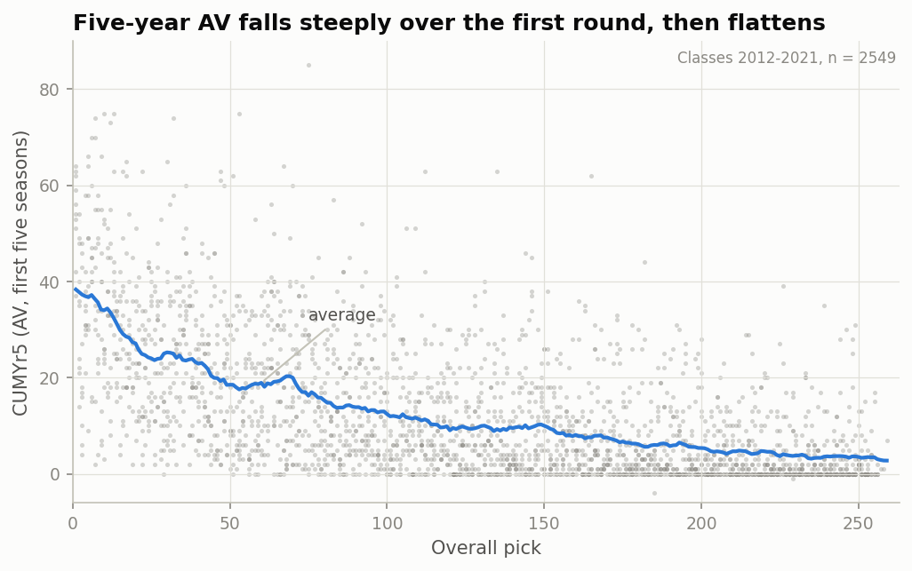

*Figure 1. CUMYr5 for every 2012-2021 draftee (grey) and a running average by
pick (blue). Value falls steeply through the first round and flattens after;
players at the same pick vary enormously.*

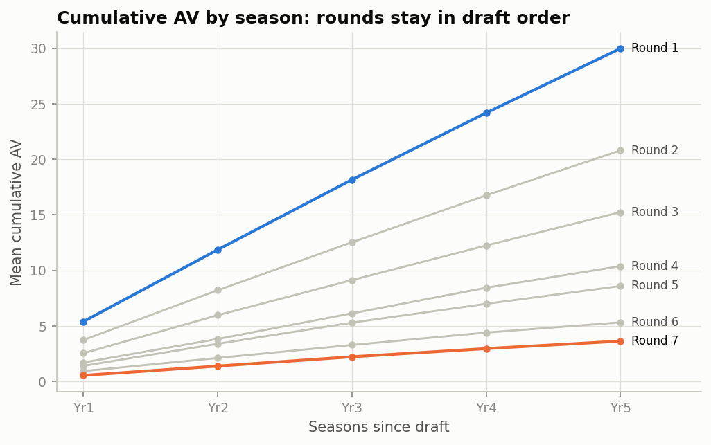

*Figure 2. Mean cumulative AV by season since the draft, for each round.*

## 3. Methods

### 3.1 Predicting CUMYr5 for unfinished careers

The 2022, 2023, 2024 and 2025 classes have played 4, 3, 2 and 1 seasons.
Rather than drop them, I predict their CUMYr5 from the seasons observed so far.
To choose and test the prediction model, I used the complete classes
2012-2021 with **leave-one-draft-class-out validation**: for each k = 1..4,
hide CUMYr5, fit on nine classes, predict the tenth from information through
season k, and repeat for all ten classes. Three generalized additive models
(GAMs) were compared:

- pick only: CUMYr5 ~ s(pick);
- the planned model: CUMYr5 ~ s(pick) + s(CUMYrk);
- an extended model: CUMYr5 ~ s(pick) + s(CUMYrk) + s(AVk) + s(CUMGk),
  adding the latest season's AV and the games played so far.

Predictions are floored at the AV already earned.

| Model (MAE, AV) | k = 1 | k = 2 | k = 3 | k = 4 |
|---|---|---|---|---|
| Pick only | 8.34 | 8.09 | 7.35 | 5.96 |
| Planned GAM | 6.33 | 4.32 | 2.86 | 1.49 |
| **Extended GAM** | **6.27** | **4.20** | **2.68** | **1.35** |

The extended model was more accurate than the planned one in 7 of 10 held-out
classes at k = 1 and in all 10 for k = 2, 3 and 4, so it is used. Both GAMs
are unbiased. Prediction error grows with the size of the prediction: at k = 1,
the error standard deviation is 4.4 AV for players predicted near 0 and 13.6
for players predicted above 25.

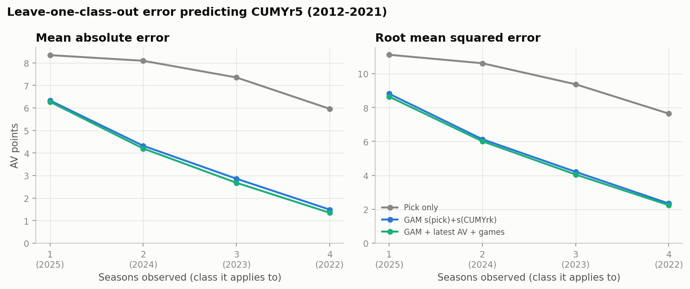

*Figure 3. Out-of-sample error in predicting CUMYr5 from the first k seasons.*

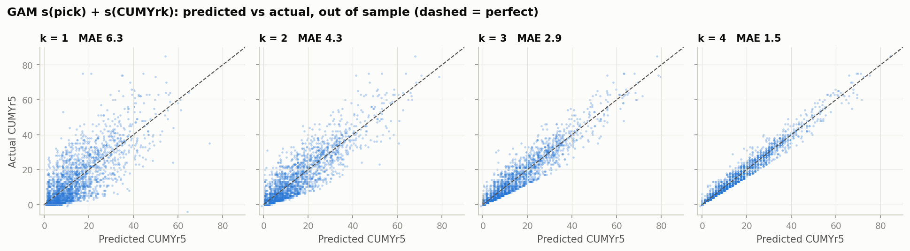

*Figure 4. Predicted vs actual CUMYr5, out of sample, for k = 1 to 4.*

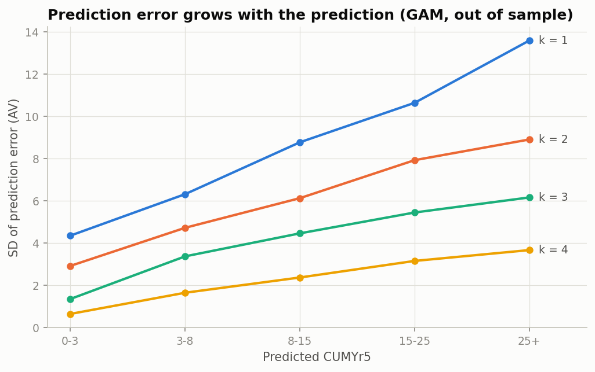

*Figure 5. The spread of prediction errors grows with the prediction.*

### 3.2 Multiple imputation

Each 2022-2025 player receives 100 imputed values of CUMYr5. Each value is the
extended GAM's prediction (fit on all of 2012-2021) plus an error drawn from
the out-of-sample errors of step 3.1: from one of the 25 past players with the
closest prediction, so the spread grows with the prediction and keeps the
skewed shape of real errors. Within each imputation, all errors come from one
randomly chosen past draft class, so that a class performing better or worse
than predicted as a whole is represented. Values are rounded to whole AV and
floored at AV already earned.

Checked on 2012-2021 (each class imputed from the other nine), 95% intervals
contain the true CUMYr5 for 96-97% of players and 80% intervals for 84-88%;
for players predicted above 15 AV, 80% coverage is 78-83%. Intervals are
conservative for fringe players because AV is whole-numbered and many
players add nothing more.

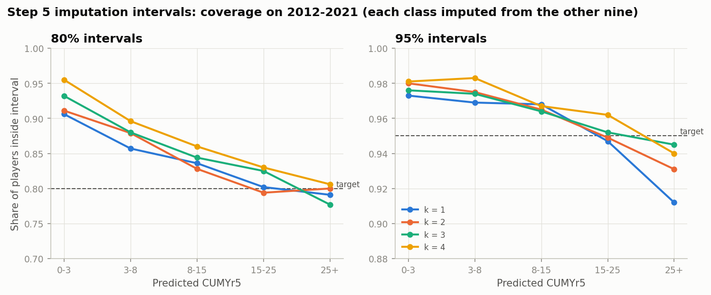

*Figure 6. Share of 2012-2021 players inside their imputation intervals, by
predicted CUMYr5.*

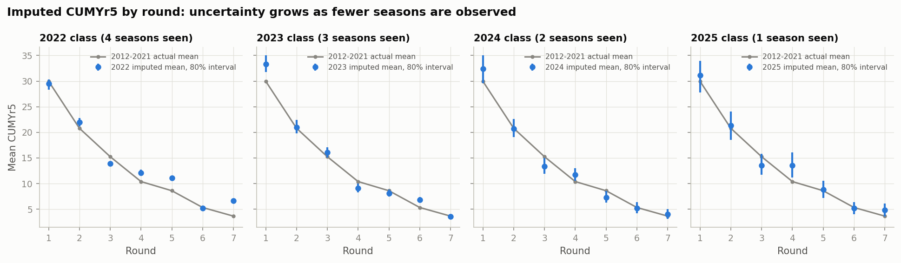

*Figure 7. Imputed mean CUMYr5 by round for 2022-2025 with 80% intervals,
against the 2012-2021 actual means.*

### 3.3 Bayesian monotone regression

Let y be a player's CUMYr5 and d his pick, and let x = 1 - (d - 1)/261 so that
x = 1 at pick 1 and x = 0 at pick 262. Following Wilson et al. (2020), the
value curve is

    y = f(x) + e,   e ~ N(0, s^2),
    f(x) = sum_{k=0}^{M} psi_k(x, M) beta_k,
    psi_k(x, M) = C(M, k) x^k (1 - x)^(M - k),

a weighted sum of Bernstein polynomials of order M. Writing theta_0 = beta_0
and theta_k = beta_k - beta_{k-1}, f is increasing in x, and therefore
**non-increasing in pick**, whenever theta_k >= 0 for k >= 1. Each increment
has the prior

    theta_k ~ pi * delta_0 + (1 - pi) * P,   P ~ DP(alpha * TN[0, inf)(mu, phi^2)),

a point mass at zero (so the curve can flatten) mixed with a Dirichlet process
whose base is a normal truncated to positive values (so increments can share
values). CUMYr5 is standardized; the intercept has a normal prior, 1/s^2 a
gamma prior, pi a Beta(1, 1) prior and alpha a Gamma(1, 1) prior. With M = 50
the curve is flexible but smooth.

Posterior draws come from a Gibbs sampler following Wilson et al.: each
increment's cluster (zero, an existing value or a new value) is updated from
its Polya-urn conditional; the intercept and all cluster values are then
updated together from their truncated multivariate normal conditional; then
the error variance and alpha (Escobar and West, 1995). Because f depends on
the data only through the pick, the likelihood is computed exactly from
per-pick counts, sums and sums of squares. The authors provide R code; this
project implements the model in Python.

### 3.4 Choosing the prior by simulation

Wilson et al. recommend mu = 0.5 and phi = 0.25 on standardized data, which
favors a few large steps. A draft value curve instead falls about 2.5
standard deviations over many small steps. Before fitting the real data, I
fit four prior settings to 20 simulated datasets each, built on the real
draft picks, for two known true curves: one shaped like the real data with
noise resampled from real residuals, and a smooth exponential curve with
normal noise.

| Prior | 95% band contains truth: real-shaped | exponential | Error of posterior mean (AV) |
|---|---|---|---|
| M = 50, mu = 0.5, phi = 0.25 (paper default) | 90% | 94% | 0.58 / 0.56 |
| **M = 50, mu = 0.1, phi = 0.1** | **94%** | **95%** | **0.54 / 0.54** |
| M = 50, mu = 0.05, phi = 0.05 | 92% | 92% | 0.58 / 0.59 |
| M = 20, mu = 0.5, phi = 0.25 | 92% | 89% | 0.50 / 0.55 |

The second setting gives the most accurate coverage and the smallest error
and is used for the chart. Coverage is slightly lower within the first round
(91%) than overall.

### 3.5 Fitting the chart

The model is fit separately to each of the 100 imputed datasets (all 3,584
players; 2012-2021 values observed, 2022-2025 imputed), with 400 burn-in
iterations and 200 draws kept from the next 1,000, run as 20 parallel chains.
Pooling the draws (20,000 in total) gives a posterior that reflects both the
uncertainty in the curve and the uncertainty in the imputed careers (Rubin,
1987). Convergence was checked with split R-hat across the 20 chains of a fit
to the 2012-2021 data (Gelman et al., 2013): at most 1.008 for picks 1-224
and at most 1.016 at the last picks.

### 3.6 Comparison methods

For comparison I fit, to the same data: isotonic regression (a non-increasing
step function); XGBoost with a decreasing monotone constraint; a penalized
spline with a decreasing constraint; a cubic regression spline with a knot
every 32 picks (one per round, not constrained); and the plain average at each
pick. Each was scored by leave-one-draft-class-out prediction of individual
players' CUMYr5 on 2012-2021, like the Bayesian curve.

## 4. Results

### 4.1 The bounded value chart

| Pick | Value: CUMYr5 (AV) | 95% bounds | Relative to pick 1 | 95% bounds |
|---|---|---|---|---|
| 1 | 39.7 | 36.7 - 42.5 | 100 | |
| 10 | 33.7 | 32.2 - 35.2 | 85 | 80 - 91 |
| 32 | 23.9 | 22.7 - 25.0 | 60 | 55 - 66 |
| 64 | 18.0 | 16.9 - 19.0 | 45 | 41 - 50 |
| 100 | 12.7 | 11.7 - 13.6 | 32 | 29 - 36 |
| 160 | 8.3 | 7.4 - 9.2 | 21 | 18 - 24 |
| 224 | 4.3 | 3.5 - 5.2 | 11 | 9 - 13 |

The full chart for picks 1-262, with 80% and 95% bounds, is in
`results/tables/step6_value_chart.csv`. All 20,000 posterior curves are
monotone non-increasing. The bounds are widest at the top of the draft, where
outcomes vary most, and at picks above 253, which exist only in some years.

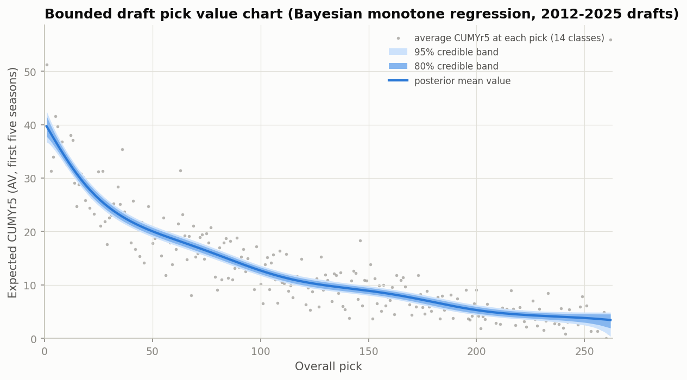

*Figure 8. The bounded value chart: posterior mean expected CUMYr5 with 80% and
95% credible bands, over the average CUMYr5 at each pick.*

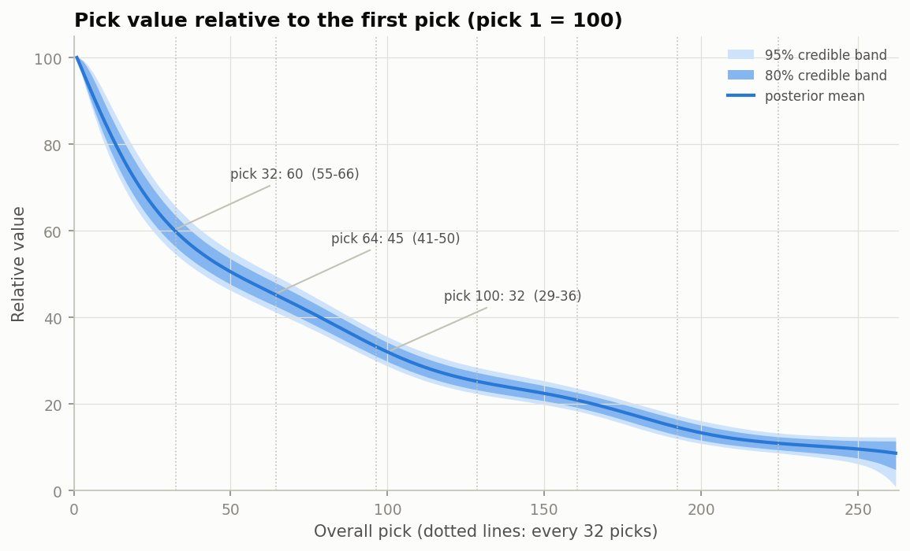

*Figure 9. The same chart relative to the first pick.*

Fitting the complete classes 2012-2021 alone gives almost the same curve
(pick 1: 38.8; pick 32: 23.7; pick 64: 18.1; pick 100: 12.6). Including the
imputed 2022-2025 classes narrows the average 95% band from 2.40 to 2.13 AV,
because there are more players, even though the imputation uncertainty is
included.

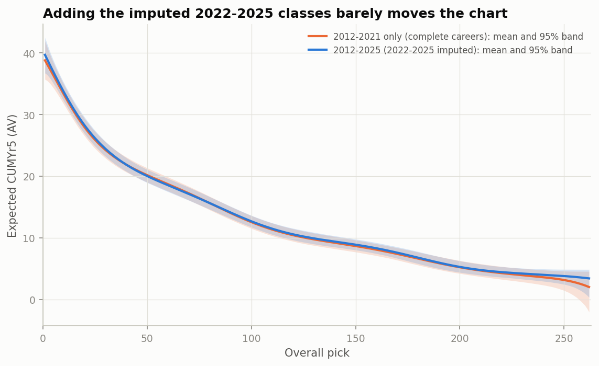

*Figure 10. The chart from 2012-2021 only vs all classes with imputation.*

### 4.2 Comparison with the Jimmy Johnson chart

On a scale where pick 1 = 100, the traditional chart gives pick 32 about 20,
pick 64 about 9 and pick 100 about 3. The performance-based chart gives 60,
45 and 32, with 95% bounds that exclude the traditional values by a wide
margin. By what players go on to produce, the traditional chart overvalues
the top picks relative to later ones, consistent with Schuckers (2011) and
Massey and Thaler (2013).

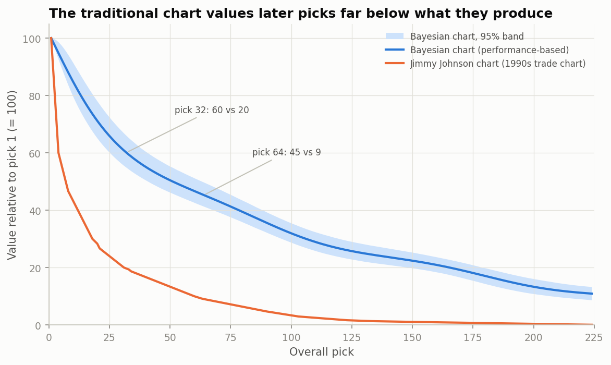

*Figure 12. Relative value, pick 1 = 100: this chart with its 95% band vs the
Jimmy Johnson chart.*

### 4.3 Comparison with other curve-fitting methods

| Method | Out-of-sample RMSE | MAE | Points where value goes up | Bounds |
|---|---|---|---|---|
| **Bayesian monotone (this project)** | 11.14 | 8.35 | 0 | yes |
| Isotonic regression | 11.09 | 8.30 | 0 | no |
| XGBoost, monotone | 11.11 | 8.27 | 0 | no |
| Monotone penalized spline | 11.15 | 8.36 | 0 | no |
| Spline, knot every 32 picks | 11.14 | 8.35 | 5 | no |
| Average at each pick | 11.52 | 8.54 | 121 | no |

All smoothed or monotone methods predict individual players almost equally
well; the differences (at most 0.09 AV in MAE) are small next to the spread of
player outcomes. The plain per-pick average is clearly worse, and the
unconstrained spline rises in five places and turns sharply upward over the
last few picks, where data are thin. Isotonic regression and XGBoost produce
step functions that jump at arbitrary picks. The Bayesian curve is the only
method that is smooth, never increasing, and reports its own uncertainty.

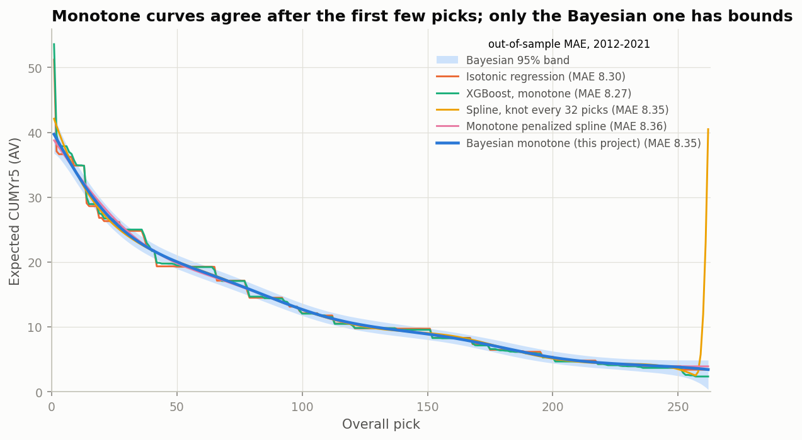

*Figure 11. The Bayesian chart and its 95% band against other methods.*

### 4.4 The first overall pick

The ten first overall picks of 2012-2021 averaged 54.1 AV (standard error
2.8): Andrew Luck, Jameis Winston, Jared Goff, Myles Garrett, Baker Mayfield,
Kyler Murray, Joe Burrow and Trevor Lawrence all had 51-64, and the lowest was
37. Picks 2-10 averaged 35.4, with no clear downward trend among them (picks
2-3 averaged 28.9 and picks 4-10 37.3). The first pick is therefore a category
of its own, while the rest of the top ten is roughly flat. The smooth
chart, which borrows strength from neighboring picks, gives pick 1 a value of
39.7; a more flexible version with M = 200 gives almost the same value. Isotonic
regression and XGBoost, which can jump at a single pick, give 51-54. For
trades involving the first pick, its own history is the better guide.

## 5. Discussion

**Main findings.** A monotone, performance-based chart with credible bounds is
feasible with a few hundred players per round. Its bounds are narrow relative
to the differences between picks (about +/-1 AV in the middle rounds), so the
chart can distinguish picks a round apart with confidence but not adjacent
picks. The shape agrees with earlier performance-based work: the last pick of
the first round is worth about 60% of the first, not the 20% of the
traditional chart.

**What the bounds mean.** The bounds describe uncertainty about the *average*
value of a pick, which is what a trade chart needs. Individual players at the
same pick vary far more: a pick-40 player can finish with 0 AV or 70.

**Limitations.**

- *Approximate Value* is a rough, position-dependent measure; offensive
  linemen and quarterbacks earn AV differently, and it does not measure
  salary value.
- *Five seasons* capture the rookie contract but not a player's full career.
- *Smoothness* is an assumption. It stabilizes the chart but understates the
  first overall pick (section 4.4).
- *Imputation* for 2022-2025 depends on the relationship between early and
  five-year AV staying as it was in 2012-2021. The chart barely changes
  without those classes.
- The simulation study found 95% bands that contain the true curve about
  94-95% of the time overall and about 91% within the first round.

**Extensions.** Position-specific charts; a value measure based on second
contracts; separate treatment of the first pick; and the same approach for
the NHL draft, as in the original working paper.

## Reproducibility

All code is in Python. `py run_all.py` rebuilds every table and figure from
the raw data in `data/raw/`, in order:

| Step | Script | Output |
|---|---|---|
| 1 | `src/step1_draft.py` | draft list |
| 2 | `src/step2_stathead.py` (manual export helper) | `data/raw/stathead/` |
| 3 | `src/step3_dataset.py` | `data/processed/nfl_draft_cumulative_2012_2025.csv` |
| 4 | `src/step4_imputation_eval.py` | prediction model comparison |
| 5 | `src/step5_impute.py` | 100 imputations for 2022-2025 |
| 6a | `src/step6a_simulation_check.py` | prior choice by simulation |
| 6 | `src/step6_value_chart.py` (model in `src/bnmr.py`) | the bounded value chart |
| 7 | `src/step7_compare_models.py` | comparison methods, Jimmy Johnson chart |

Details of every rule, check and decision are in `docs/METHODS.md`.

## Acknowledgements

I thank Dr. Michael Schuckers for mentoring this project. Data are from
Pro-Football-Reference.com and Stathead (Sports Reference LLC), used for
non-commercial academic research. Parts of the code and write-up were
developed with the assistance of an AI coding tool (Claude); all analysis
decisions, checks and interpretation are my own.

## References

- Curtis, S. M. and Ghosh, S. K. (2011). A variable selection approach to
  monotonic regression with Bernstein polynomials. *Journal of Applied
  Statistics*, 38(5), 961-976.
- Drinen, D. Approximate Value. Pro-Football-Reference / Sports-Reference
  blog.
- Escobar, M. D. and West, M. (1995). Bayesian density estimation and
  inference using mixtures. *Journal of the American Statistical Association*,
  90(430), 577-588.
- Gelman, A., Carlin, J. B., Stern, H. S., Dunson, D. B., Vehtari, A. and
  Rubin, D. B. (2013). *Bayesian Data Analysis* (3rd ed.). CRC Press.
- Massey, C. and Thaler, R. H. (2013). The loser's curse: Decision making and
  market efficiency in the National Football League draft. *Management
  Science*, 59(7), 1479-1495.
- Rubin, D. B. (1987). *Multiple Imputation for Nonresponse in Surveys*.
  Wiley.
- Schuckers, M. (2011). An alternative to the NFL draft pick value chart
  based upon player performance. *Journal of Quantitative Analysis in
  Sports*, 7(2).
- Wilson, A., Tryner, J., L'Orange, C. and Volckens, J. (2020). Bayesian
  nonparametric monotone regression. *Environmetrics*, 31(8), e2642.
